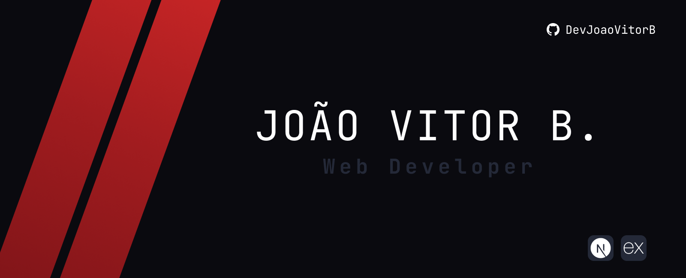

<figure>
  
</figure>

<h3 align="center">Web Developer • Student • Future Game Developer</h3>

 

  <h2>About Me</h2>
  <strong>College Student</strong>  
  <strong>Aspiring Developer</strong>  
  <strong>Game Fan and Future Game Developer!</strong>  
  <strong>Creative for the development of new project</strong>

  <h2>My Stack</h2>
  

  <h2>Contact Me</h2>
  
  

